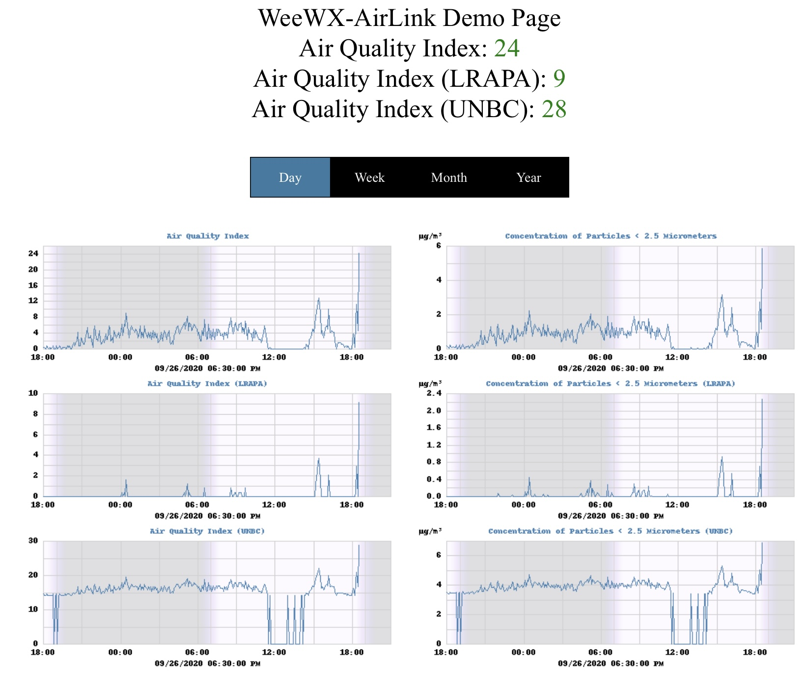

# weewx-airlink
*Open source plugin for WeeWX software.

## Description

A WeeWX plugin that gets its AirLink sensor readings either directly
from the AirLink sensor or from a
[airlink-proxy](https://github.com/chaunceygardiner/airlink-proxy) service.

Copyright (C)2020-2024 by John A Kline (john@johnkline.com)

**This plugin requires Python 3.7, WeeWX 4 or 5 and the
[wview_extended](https://github.com/weewx/weewx/blob/master/src/schemas/wview_extended.py)
schema**

weewx-airlink requires the
[wview_extended](https://github.com/weewx/weewx/blob/master/src/schemas/wview_extended.py)
in WeeWX 4 that contains pm1_0, pm2_5 and pm10_0 columns.  With the weewx-airlink
extension, Loop records will be populated with pm1_0, pm2_5 and pm10_0 fields that
correspond to AirLink's pm_1_last, pm_2p5_last and pm_10_last fields.

In addition to pm1_0, pm2_5 and pm10_0, AQI variables are also available
(even though they are not in the database) via WeeWX 4's
[XTypes](https://github.com/weewx/weewx/wiki/WeeWX-V4-user-defined-types).
pm2_5_aqi is automatically computed from pm2_5 and can be used in reports
(`$current.pm2_5_aqi`, `$day.pm2_5_aqi`) and in graphs
(`[[[[pm2_5_aqi]]]`).  Also available is
is the [RGBint](https://www.shodor.org/stella2java/rgbint.html) value
`$current.pm2_5_aqi_color` (useful for displaying AQI in the appropriate color
(e.g., green for AQIs <= 50).

As of v1.2, no EPA correction is applied ot the Airlink readings.  The EPA correction
needs PM2.5 CF1 readings, but the Airlink only provides PM2.5 ATM readings.  Hence
forth, this Airlink extension will report Airlink readings with no correction.

The `pm1_0`, `pm2_5`, `pm10_0`, 'pm2_5_aqi' and 'pm2_5_aqi_color' fields are
available for reporting and graphs, the following additional
fields are inserted into loop records (useful for real time updating):
`pm1_0_1m`: PM1 1 minute average
`pm2_5_1m`: PM2.5 1 minute average
`pm10_0_1m`: PM10 1 minute average
`pm2_5_1m_aqi`: PM2.5 1m AQI
`pm2_5_1m_aqi_color`: PM2.5 1m AQI color
`pm2_5_nowcast`: : PM2.5 NowCast
`pm2_5_nowcast_aqi`: PM2.5 NowCast AQI
`pm2_5_nowcast_aqi_color`: PM2.5 NowCast AQI color
`pm10_0_nowcast`: PM10 NowCast

A skin is provided to show a sample report:


# Installation Instructions

If you don't meet the following requirements, do not install this extension.
  * WeeWX 4 or 5
  * Using WeeWX 4's (or 5's) wview_extended schema.
  * Python 3.7 or greater

## WeeWX 5 Installation Instructions

1. Activate the virtual environment (actual syntax varies by type of WeeWX install):
   `/home/weewx/weewx-venv/bin/activate`

1. Install the dateutil package.

   `pip install dateutil`

1. Install the requests package.

   `apt install requests`


1. Download the lastest release, weewx-airlink-1.3.zip, from the
   [GitHub Repository](https://github.com/chaunceygardiner/weewx-airlink).

1. Install the airlink extension.

   `weectl extension install weewx-airlink-1.3.zip`

1. Edit the `AirLink` section of weewx.conf (which was created by the install
   above).  In particular, change the hostname in the section labeled Sensor1 to
   be a name resolvable to the IP address of an AirLink sensor or the IP address
   of an AirLink sensor.  More sensors can be specified.  For example, to add
   a second AirLink sensor, enable the Sensor2 section and specify the hostname.
   There is no limit to how many sensors can be configured; but the numbering must
   be consecutive.  The order in which sensors are interrogated is low numbers to
   high.  Once a sensor replies, no further sensors are interrogated for the current
   polling round.

   Note: The port can be specified because this extension also works with the
   [airlink-proxy](https://github.com/chaunceygardiner/airlink-proxy) service.
   That service typcially uses port 8000.

   ```
   [AirLink]
       [[Sensor1]]
           enable = true
           hostname = airlink
           port = 80
           timeout = 2
       [[Sensor2]]
           enable = false
           hostname = airlink2
           port = 80
           timeout = 2
   ```

1. Restart WeeWX

1. To check for a successful install, wait for a reporting cycle, then
   navigate in a browser to the WeeWX site and add /airlink to the end
   of the URL (e.g., http://weewx-machine/weewx/airlink).
   The PM2.5 and AQI graphs will fill in over time.

## WeeWX 4 Installation Instructions

1. Install python3's dateutil package.  On debian, that can be accomplished with:

   `apt install python3-dateutil`

1. Install python3's requests package.  On debian, that can be accomplished with:

   `apt install python3-requests`

1. Download the lastest release, weewx-airlink-1.3.zip, from the
   [GitHub Repository](https://github.com/chaunceygardiner/weewx-airlink).

1. Run the following command.

   `sudo /home/weewx/bin/wee_extension --install weewx-airlink-1.3.zip`

   Note: this command assumes weewx is installed in /home/weewx.  If it's installed
   elsewhere, adjust the path of wee_extension accordingly.

1. Edit the `AirLink` section of weewx.conf (which was created by the install
   above).  In particular, change the hostname in the section labeled Sensor1 to
   be a name resolvable to the IP address of an AirLink sensor or the IP address
   of an AirLink sensor.  More sensors can be specified.  For example, to add
   a second AirLink sensor, enable the Sensor2 section and specify the hostname.
   There is no limit to how many sensors can be configured; but the numbering must
   be consecutive.  The order in which sensors are interrogated is low numbers to
   high.  Once a sensor replies, no further sensors are interrogated for the current
   polling round.

   Note: The port can be specified because this extension also works with the
   [airlink-proxy](https://github.com/chaunceygardiner/airlink-proxy) service.
   That service typcially uses port 8000.

   ```
   [AirLink]
       [[Sensor1]]
           enable = true
           hostname = airlink
           port = 80
           timeout = 2
       [[Sensor2]]
           enable = false
           hostname = airlink2
           port = 80
           timeout = 2
   ```

1. Restart WeeWX

1. To check for a successful install, wait for a reporting cycle, then
   navigate in a browser to the WeeWX site and add /airlink to the end
   of the URL (e.g., http://weewx-machine/weewx/airlink).
   The PM2.5 and AQI graphs will fill in over time.

# How to access weewx-airlink fields in reports.

Note: Although the examples below show the use of $current, aggregates are also
supported (e.g., the high PM2.5 for the week can be presented with `$week.pm2_5.max`.

To show the PM2.5 reading, use the following:
```
$current.pm2_5
```

To show the Air Quality Index:
```
$current.pm2_5_aqi
```

To get the RGBINT color of the current Air Quality Index:
```
#set $color = int($current.pm2_5_aqi_color.raw)
#set $blue  =  $color & 255
#set $green = ($color >> 8) & 255
#set $red   = ($color >> 16) & 255
```

To show the PM1.0 reading, use the following:
```
$current.pm1_0
```

To show the PM10.0 reading, use the following:
```
$current.pm10_0
```

## Licensing

weewx-airlink is licensed under the GNU Public License v3.
