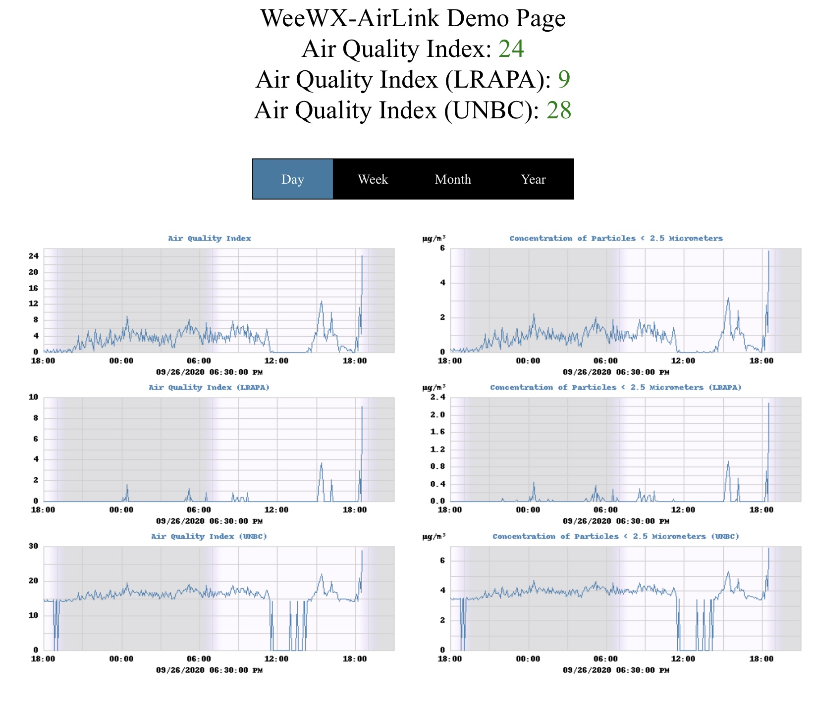

# weewx-airlink

A WeeWX extension that reads a [Davis AirLink](https://www.davisinstruments.com/airlink/)
air quality sensor on the local network (or an
[airlink-proxy](https://github.com/chaunceygardiner/airlink-proxy) service) and
inserts particulate concentrations into every WeeWX loop packet.

Copyright (C) 2020-2026 by John A Kline (john@johnkline.com)

**Requires:**
* WeeWX 4 or 5
* Python 3.7 or greater
* The [wview_extended](https://github.com/weewx/weewx/blob/master/src/schemas/wview_extended.py)
  schema (it contains the `pm1_0`, `pm2_5` and `pm10_0` columns)
* The `requests` Python package
* A Davis AirLink sensor reachable on your local network

Not sure about the schema?  wview_extended is the default for new WeeWX 4
and 5 installs; only databases created under WeeWX 3 and carried forward
still use the old schema.  To check, look for `pm2_5` in your archive
table, e.g.:

```
echo '.schema archive' | sqlite3 /var/lib/weewx/weewx.sdb | grep pm2_5
```

## What it does

Every loop packet is populated with the AirLink's instantaneous readings
under the wview_extended column names (so they land in the database and in
history graphs on their own):

| Field     | Contents                                            |
|-----------|-----------------------------------------------------|
| `pm1_0`   | PM1.0 concentration (µg/m³)                         |
| `pm2_5`   | PM2.5 concentration (µg/m³)                         |
| `pm10_0`  | PM10.0 concentration (µg/m³)                        |

Loop packets also carry the smoother variants the AirLink computes —
useful for real-time displays (e.g., with
[weewx-loopdata](https://github.com/chaunceygardiner/weewx-loopdata)),
though they are not stored in the database:

| Field                      | Contents                                     |
|----------------------------|----------------------------------------------|
| `pm1_0_1m`                 | PM1.0, 1-minute average                      |
| `pm2_5_1m`                 | PM2.5, 1-minute average                      |
| `pm10_0_1m`                | PM10.0, 1-minute average                     |
| `pm2_5_1m_aqi`             | AQI computed from `pm2_5_1m`                 |
| `pm2_5_1m_aqi_color`       | RGB color of that AQI's category             |
| `pm2_5_nowcast`            | PM2.5 [NowCast](https://en.wikipedia.org/wiki/NowCast_(air_quality_index)) average |
| `pm2_5_nowcast_aqi`        | AQI computed from `pm2_5_nowcast`            |
| `pm2_5_nowcast_aqi_color`  | RGB color of that AQI's category             |
| `pm10_0_nowcast`           | PM10.0 NowCast average                       |

Finally, two observation types are available everywhere in reports and
graphs — without being stored in the database — via WeeWX
[XTypes](https://github.com/weewx/weewx/wiki/WeeWX-V4-user-defined-types):

| Field              | Contents                                                         |
|--------------------|------------------------------------------------------------------|
| `pm2_5_aqi`        | US EPA Air Quality Index computed from `pm2_5` (2024 definition) |
| `pm2_5_aqi_color`  | The RGB color of the AQI category, as a single integer           |

Readings are sanity checked (missing or non-numeric fields, stale
timestamps and device error responses are rejected), and responses from
early AirLink firmware (data structure type 5) are converted
automatically.  If multiple sensors are configured, they are tried in
order until one produces a good reading.  No correction is applied to the
readings: the Davis-reported concentrations are inserted as-is.

### AQI categories

`pm2_5_aqi` conforms to the
[2024 EPA AQI definition](https://www.epa.gov/system/files/documents/2024-02/pm-naaqs-air-quality-index-fact-sheet.pdf);
`pm2_5_aqi_color` uses the EPA-defined RGB colors:

| Category                       | AQI       | 24-hr PM2.5 (µg/m³) | Color  | RGB           |
|--------------------------------|-----------|---------------------|--------|---------------|
| Good                           | 0 - 50    | 0.0 - 9.0           | Green  | (0, 228, 0)   |
| Moderate                       | 51 - 100  | 9.1 - 35.4          | Yellow | (255, 255, 0) |
| Unhealthy for Sensitive Groups | 101 - 150 | 35.5 - 55.4         | Orange | (255, 126, 0) |
| Unhealthy                      | 151 - 200 | 55.5 - 125.4        | Red    | (255, 0, 0)   |
| Very Unhealthy                 | 201 - 300 | 125.5 - 225.4       | Purple | (143, 63, 151)|
| Hazardous                      | 301 - 500 | 225.5 - 325.4       | Maroon | (126, 0, 35)  |

Concentrations above 325.4 µg/m³ map to AQI values above 500, continuing on
the same slope as AQI 301-500 (per the May 2024
[AirNow Technical Assistance Document](https://document.airnow.gov/technical-assistance-document-for-the-reporting-of-daily-air-quailty.pdf)).
The category and color remain Hazardous/Maroon.

### Demo skin

A small demo report is installed at `<HTML_ROOT>/airlink`:



### What's airlink-proxy?

[airlink-proxy](https://github.com/chaunceygardiner/airlink-proxy) is an
optional service that averages sensor readings over the archive period.
It typically answers on port 8000; point a `[[SensorN]]` section at it.
If in doubt, skip it and query the AirLink sensor directly.

# Installation

1. Find your sensor on the network and verify you can reach it.

   Find the AirLink's IP address (e.g., in your router's DHCP client list
   or the WeatherLink app), then browse to
   `http://<sensor-ip>/v1/current_conditions`.  You should see a page of
   JSON sensor data — that is exactly the endpoint this extension polls.
   Since the extension needs a stable address, give the sensor a DHCP
   reservation in your router (or a hostname in local DNS) so its address
   doesn't change.

1. Install the prerequisite Python package.

   For a WeeWX pip install, activate WeeWX's virtual environment first, then:

   ```
   pip install requests
   ```

   For a Debian package install of WeeWX:

   ```
   apt install python3-requests
   ```

1. Download the latest release, `weewx-airlink.zip`, from the
   [GitHub repository](https://github.com/chaunceygardiner/weewx-airlink).

1. Install the extension and restart WeeWX.

   WeeWX 5:

   ```
   weectl extension install weewx-airlink.zip
   ```

   WeeWX 4 (adjust the path if WeeWX is not installed in /home/weewx):

   ```
   sudo /home/weewx/bin/wee_extension --install weewx-airlink.zip
   ```

1. Edit the `[AirLink]` section of weewx.conf (created by the install) to
   point at your sensor, then restart WeeWX.

1. To check the install, wait for a reporting cycle, then browse to the WeeWX
   site with `/airlink` appended to the URL
   (e.g., `http://weewx-machine/weewx/airlink`).  The PM2.5 and AQI graphs
   fill in over time.

## Configuration

```
[AirLink]
    [[Sensor1]]
        enable = true
        hostname = airlink
        port = 80
        timeout = 2
    [[Sensor2]]
        enable = false
        hostname = airlink2
        port = 80
        timeout = 2
```

| Option     | Default | Meaning                                       |
|------------|---------|-----------------------------------------------|
| `enable`   | false   | Whether this source is polled                 |
| `hostname` |         | Hostname or IP address of the sensor (or airlink-proxy) |
| `port`     | 80      | Port to connect on (airlink-proxy: 8000)      |
| `timeout`  | 10      | HTTP timeout (seconds)                        |

Sensors are specified with subsections `[[Sensor1]]`, `[[Sensor2]]`, etc.
There is no limit on the number of sensors, but the numbering must start
at 1 and be consecutive (a gap ends the scan).  On each polling round
(every 5 seconds), sensors are interrogated low numbers to high; the
first one that yields a sane, fresh reading wins and no further sensors
are tried.

A reading is considered fresh for one archive interval; stale readings
are never inserted into loop packets.

# Using weewx-airlink fields in reports

Current values:

```
$current.pm1_0
$current.pm2_5
$current.pm10_0
$current.pm2_5_aqi
$current.pm2_5_aqi_color
```

Aggregates work for both the database-backed fields and the AQI xtypes
(supported AQI aggregates: `avg`, `min`, `max`, `first`, `last`, `count`):

```
$day.pm2_5.max
$week.pm2_5.avg
$day.pm2_5_aqi.max
```

Both `pm2_5_aqi` and `pm2_5_aqi_color` can also be graphed, e.g. in
skin.conf's `[ImageGenerator]` section:

```
        [[[dayaqi]]]
            [[[[pm2_5_aqi]]]]
```

`pm2_5_aqi_color` is an [RGBint](https://www.shodor.org/stella2java/rgbint.html)
value, useful for displaying the AQI in the color of its category.  To unpack
it in a Cheetah template:

```
#set $color = int($current.pm2_5_aqi_color.raw)
#set $blue  =  $color & 255
#set $green = ($color >> 8) & 255
#set $red   = ($color >> 16) & 255
```

## How AQI values are computed (and stored)

AQI is always computed on demand from the stored `pm2_5` concentration —
there is no AQI column in the database, and none is needed: `$current`,
aggregates and graphs all resolve through the extension's AQI xtype.  For
real-time consumers (e.g., MQTT), the AQI fields are also present in
every LOOP packet.

To keep the on-demand computation authoritative, the extension registers
`extractor = noop` for the six AQI/color fields so that WeeWX's
accumulator does not average them into archive records (averaging AQI
values is meaningless, since AQI is a non-linear transform of
concentration).  An `[Accumulator]` section in weewx.conf takes
precedence if you deliberately want different behavior.

### If you added an AQI column to your database

Some users have added a `pm2_5_aqi` (or `pm2_5_aqi_color`) column to their
database schema.  As of 2.0.1 the accumulator no longer fills such a
column, and any values stored in it *before* 2.0.1 are accumulator
averages that disagree with what the xtype computes (non-integer, and
averaged across a non-linear transform).  While present, those stored
values also override the xtype for `$current`.

**The cleanest fix is to remove the column.**  With WeeWX stopped (for a
pip install, activate WeeWX's virtual environment first):

WeeWX 5:

```
weectl database drop-columns pm2_5_aqi
```

WeeWX 4 (adjust the path if WeeWX is not installed in /home/weewx):

```
sudo /home/weewx/bin/wee_database --drop-columns=pm2_5_aqi
```

Name exactly the column(s) you added (repeat for `pm2_5_aqi_color` if you
added that too — naming a column that doesn't exist aborts the whole
command).  This also removes the matching daily-summary table.  Restart
WeeWX; no configuration changes are needed — `$current`, aggregates and
graphs all resolve through the xtype again.

**If something outside WeeWX reads the column directly** (e.g., Grafana),
keep it and have WeeWX compute it through the xtype, which stores
correctly EPA-rounded values:

```
[StdWXCalculate]
    [[Calculations]]
        pm2_5_aqi = prefer_hardware
        pm2_5_aqi_color = prefer_hardware
```

Then purge any values stored before 2.0.1 and backfill them through the
xtype:

1. Add the `[StdWXCalculate]` entries above to weewx.conf.

1. Stop WeeWX and back up the database.

1. NULL out the old values — for each AQI column you added, e.g. with
   SQLite (adapt for MySQL):

   ```
   sqlite3 /path/to/archive.sdb "UPDATE archive SET pm2_5_aqi = NULL;"
   ```

1. Backfill.  WeeWX 5: `weectl database calc-missing`; WeeWX 4:
   `wee_database --calc-missing`.  This recomputes each NULLed value from
   that record's stored `pm2_5` and recalculates the daily summaries.
   (It loads the extension to get the AQI xtype, so expect AirLink's
   startup log lines, including a sensor fetch.)

1. Restart WeeWX.

# Troubleshooting

* `AirLink extension is inoperable` in the log: no source has
  `enable = true` in `[AirLink]`.
* `Found no fresh concentrations to insert.`: the sensor has stopped
  answering (or is answering with stale or insane readings).  Logged once
  per outage; `Fresh concentrations available again.` is logged on
  recovery.
* `Reading not sane: ...`: the reason and the offending reading are
  included in the message.
* To smoke test the sanity checker without a sensor:

  ```
  PYTHONPATH=<weewx-bin-dir> python bin/user/airlink.py --test-is-sane
  ```

* To watch what the collector sees, run the module directly against a
  sensor:

  ```
  PYTHONPATH=<weewx-bin-dir> python bin/user/airlink.py --test-extension --hostname <sensor> [--port <port>]
  ```

# Running the test suite

The tests are hermetic (no sensor or network required).  From a Python
environment with WeeWX installed:

```
PYTHONPATH=bin python -m pytest tests
```

## Licensing

weewx-airlink is licensed under the GNU Public License v3.
