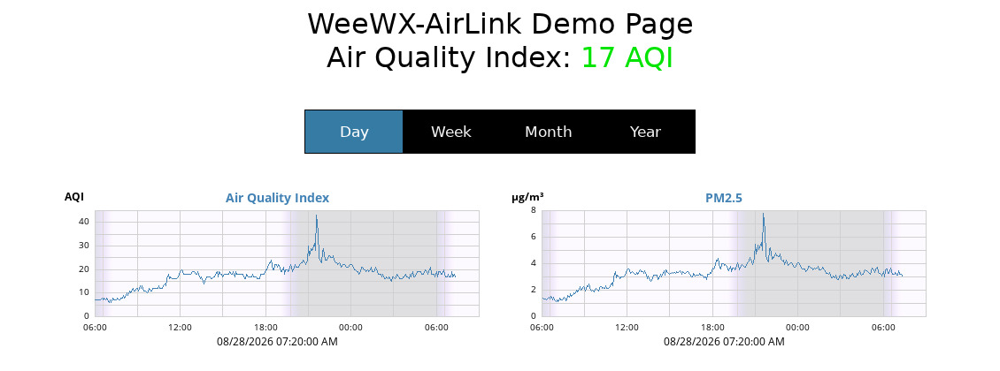

# weewx-airlink

A WeeWX extension that reads a [Davis AirLink](https://www.davisinstruments.com/airlink/)
air quality sensor on the local network (or an
[airlink-proxy](https://github.com/chaunceygardiner/airlink-proxy) service) and
inserts particulate concentrations into every WeeWX loop packet.

Copyright (C) 2020-2026 by John A Kline (john@johnkline.com)

[User manual](https://chaunceygardiner.github.io/weewx-airlink/) &middot;
[GitHub project](https://github.com/chaunceygardiner/weewx-airlink)

**Requires:**
* WeeWX 4 or 5
* Python 3.7 or greater
* The [wview_extended](https://github.com/weewx/weewx/blob/master/src/schemas/wview_extended.py)
  schema (it contains the `pm1_0`, `pm2_5` and `pm10_0` columns)
* The `requests` Python package
* A Davis AirLink sensor reachable on your local network

Not sure about the schema?  wview_extended is the default for new WeeWX 4
and 5 installs; only databases created under WeeWX 3 and carried forward
still use the old schema.  To check, look for `pm2_5` in your archive
table, e.g.:

```
echo '.schema archive' | sqlite3 /var/lib/weewx/weewx.sdb | grep pm2_5
```

## What it does

Every loop packet is populated with the AirLink's instantaneous readings
under the wview_extended column names (so they land in the database and in
history graphs on their own):

| Field     | Contents                                            |
|-----------|-----------------------------------------------------|
| `pm1_0`   | PM1.0 concentration (µg/m³)                         |
| `pm2_5`   | PM2.5 concentration (µg/m³)                         |
| `pm10_0`  | PM10.0 concentration (µg/m³)                        |

Loop packets also carry the smoother variants the AirLink computes —
useful for real-time displays (e.g., with
[weewx-loopdata](https://github.com/chaunceygardiner/weewx-loopdata)),
though they are not stored in the database:

| Field                      | Contents                                     |
|----------------------------|----------------------------------------------|
| `pm1_0_1m`                 | PM1.0, 1-minute average                      |
| `pm2_5_1m`                 | PM2.5, 1-minute average                      |
| `pm10_0_1m`                | PM10.0, 1-minute average                     |
| `pm2_5_1m_aqi`             | AQI computed from `pm2_5_1m`                 |
| `pm2_5_1m_aqi_color`       | RGB color of that AQI's category             |
| `pm2_5_nowcast`            | PM2.5 [NowCast](https://en.wikipedia.org/wiki/NowCast_(air_quality_index)) average |
| `pm2_5_nowcast_aqi`        | AQI computed from `pm2_5_nowcast`            |
| `pm2_5_nowcast_aqi_color`  | RGB color of that AQI's category             |
| `pm10_0_nowcast`           | PM10.0 NowCast average                       |

Finally, two observation types are available everywhere in reports and
graphs — without being stored in the database — via WeeWX
[XTypes](https://github.com/weewx/weewx/wiki/WeeWX-V4-user-defined-types):

| Field              | Contents                                                         |
|--------------------|------------------------------------------------------------------|
| `pm2_5_aqi`        | US EPA Air Quality Index computed from `pm2_5` (2024 definition) |
| `pm2_5_aqi_color`  | The RGB color of the AQI category, as a single integer           |

Readings are sanity checked (missing or non-numeric fields, stale
timestamps and device error responses are rejected), and responses from
early AirLink firmware (data structure type 5) are converted
automatically.  If multiple sensors are configured, they are tried in
order until one produces a good reading.  No correction is applied to the
readings: the Davis-reported concentrations are inserted as-is.

### AQI categories

`pm2_5_aqi` conforms to the
[2024 EPA AQI definition](https://www.epa.gov/system/files/documents/2024-02/pm-naaqs-air-quality-index-fact-sheet.pdf);
`pm2_5_aqi_color` uses the EPA-defined RGB colors:

| Category                       | AQI       | 24-hr PM2.5 (µg/m³) | Color  | RGB           |
|--------------------------------|-----------|---------------------|--------|---------------|
| Good                           | 0 - 50    | 0.0 - 9.0           | Green  | (0, 228, 0)   |
| Moderate                       | 51 - 100  | 9.1 - 35.4          | Yellow | (255, 255, 0) |
| Unhealthy for Sensitive Groups | 101 - 150 | 35.5 - 55.4         | Orange | (255, 126, 0) |
| Unhealthy                      | 151 - 200 | 55.5 - 125.4        | Red    | (255, 0, 0)   |
| Very Unhealthy                 | 201 - 300 | 125.5 - 225.4       | Purple | (143, 63, 151)|
| Hazardous                      | 301 - 500 | 225.5 - 325.4       | Maroon | (126, 0, 35)  |

Concentrations above 325.4 µg/m³ map to AQI values above 500, continuing on
the same slope as AQI 301-500 (per the May 2024
[AirNow Technical Assistance Document](https://document.airnow.gov/technical-assistance-document-for-the-reporting-of-daily-air-quailty.pdf)).
The category and color remain Hazardous/Maroon.

### Demo skin

A small demo report is installed at `<HTML_ROOT>/airlink`:



### What's airlink-proxy?

[airlink-proxy](https://github.com/chaunceygardiner/airlink-proxy) is an
optional service that averages sensor readings over the archive period.
It typically answers on port 8040; point a `[[ProxyN]]` section at it.
If in doubt, skip it and query the AirLink sensor directly.

# Installation

1. Find your sensor on the network and verify you can reach it.

   Find the AirLink's IP address (e.g., in your router's DHCP client list
   or the WeatherLink app), then browse to
   `http://<sensor-ip>/v1/current_conditions`.  You should see a page of
   JSON sensor data — that is exactly the endpoint this extension polls.
   Since the extension needs a stable address, give the sensor a DHCP
   reservation in your router (or a hostname in local DNS) so its address
   doesn't change.

1. Install the prerequisite Python package.

   For a WeeWX pip install, activate WeeWX's virtual environment first, then:

   ```
   pip install requests
   ```

   For a Debian package install of WeeWX:

   ```
   apt install python3-requests
   ```

1. Download the latest release, `weewx-airlink.zip`, from the
   [GitHub repository](https://github.com/chaunceygardiner/weewx-airlink).

1. Install the extension and restart WeeWX.

   WeeWX 5:

   ```
   weectl extension install weewx-airlink.zip
   ```

   WeeWX 4 (adjust the path if WeeWX is not installed in /home/weewx):

   ```
   sudo /home/weewx/bin/wee_extension --install weewx-airlink.zip
   ```

1. Edit the `[AirLink]` section of weewx.conf (created by the install) to
   point at your sensor, then restart WeeWX.

1. To check the install, wait for a reporting cycle, then browse to the WeeWX
   site with `/airlink` appended to the URL
   (e.g., `http://weewx-machine/weewx/airlink`).  The PM2.5 and AQI graphs
   fill in over time.

## Configuration

```
[AirLink]
    [[Proxy1]]
        enable = false
        hostname = proxy1
        port = 8040
        timeout = 1
    [[Sensor1]]
        enable = true
        hostname = airlink
        port = 80
        timeout = 2
    [[Sensor2]]
        enable = false
        hostname = airlink2
        port = 80
        timeout = 2
```

| Option     | Default          | Meaning                                |
|------------|------------------|----------------------------------------|
| `enable`   | false            | Whether this source is polled          |
| `hostname` |                  | Hostname or IP address of the source   |
| `port`     | 80 (proxy: 8040) | Port to connect on                     |
| `timeout`  | 10 (proxy: 1)    | HTTP timeout (seconds)                 |

`timeout` governs every request to that source -- the five-second polling
that feeds loop packets as well as the archive-record filling described
below.  One second suits a proxy answering out of its own database on the
local network; if you move a `[[SensorN]]` to a `[[ProxyN]]` and it is not
on your local network, set `timeout` explicitly rather than taking the
default.

Sources are specified with subsections `[[Proxy1]]`, `[[Proxy2]]`, etc. for
instances of [airlink-proxy](https://github.com/chaunceygardiner/airlink-proxy),
and `[[Sensor1]]`, `[[Sensor2]]`, etc. for AirLink sensors themselves.  There
is no limit on the number of either, but each kind's numbering must start at 1
and be consecutive (a gap ends the scan).  The two kinds differ only in the
defaults they pick for `port` and `timeout`: a proxy answers out of its own
database and is expected to answer quickly, while an AirLink's own processor is
slow and easily overwhelmed.

On each polling round (every 5 seconds), sources are interrogated in order --
all proxies, low numbers to high, and then all sensors -- and the first one
that yields a sane, fresh reading wins; no further sources are tried.

Earlier versions had no `[[ProxyN]]` sections, so an airlink-proxy was
configured as a `[[SensorN]]` with its port set to 8000.  That still works and
is still polled exactly as before; nothing needs to change on upgrade.

A reading is considered fresh for one archive interval; stale readings
are never inserted into loop packets.

## Filling in archive records after downtime

While WeeWX is stopped, nothing puts air quality data into loop packets.
The archive records a logger hands over when WeeWX starts again therefore
arrive with empty `pm1_0`, `pm2_5` and `pm10_0` columns, and the hole is
permanent -- in the database and in every graph drawn from it.

If a `[[ProxyN]]` is configured, weewx-airlink fills those records in: for
each archive period it contributed nothing to, it asks the proxy for the
archive records covering exactly that period and averages them.  An AirLink
queried directly keeps no history, so with no proxy configured nothing is
asked and nothing is logged.

Values written this way are still subject to `[StdQC]` and
`[StdCalibrate]`.  Those services run in `process_services`, which WeeWX
loads after the `data_services` this extension installs into, so a
`[StdQC] [[MinMax]]` limit on `pm2_5` filters a filled-in value exactly as
it filters a live one, and `[StdCalibrate]` corrections apply to both.

Only `pm1_0`, `pm2_5` and `pm10_0` are filled in.  The 1m and nowcast
variants are loop-only -- they are not database columns -- and a value is
only ever written for a period this extension put nothing into, so a period
WeeWX was up for is never touched.

Two conditions have to hold, and both are checked once per proxy and
logged when they fail:

* The proxy must speak **airlink-proxy API version 2 or later**, which
  means airlink-proxy 1.0 or later.  Earlier proxies file the single poll
  that landed on the archive boundary rather than an average over the
  interval, which is not what the period contained.
* The proxy's `archive-interval-secs` must **divide evenly into** WeeWX's
  `archive_interval`.  A shorter interval is fine -- several of the proxy's
  records cover one WeeWX period and are averaged together, so a proxy on
  60 seconds serves a WeeWX archiving every 300.  A longer interval, or one
  that does not divide, cannot answer for a WeeWX period at all, since the
  period can fall entirely inside one of the proxy's records.  Rather than
  fill such a period badly, catch-up is refused and says so in the log.

Both are asked once per proxy and the answer is remembered for as long as
WeeWX runs.  If you upgrade an airlink-proxy from API version 1 to 2, or
change its `archive-interval-secs`, **restart WeeWX** -- until you do, the
extension goes on acting on the answer it got at startup.

For a period that closed within the last two minutes and that no archive
record covers yet, the proxy's two-minute average is used instead, and
failing that the reading already in hand.  Both are subject to one rule:
a reading may fill a period only if it **overlaps** that period.  The
two-minute average covers the two minutes ending at its freshest sample, so
it qualifies when that window reaches into the period; the reading in hand
is a single instantaneous sample, so it qualifies only if it was taken
inside the period.  A sample taken after the period closed describes a
moment the period does not contain, however recent it is, and is not used.
This is also what keeps a proxy's last two-minute average out once the
AirLink stops answering -- the proxy goes on serving it, but it no longer
reaches the periods being filled.  Any period further back that no
proxy holds a record for keeps its empty columns -- that is the honest
answer, not a failure.

# Using weewx-airlink fields in reports

Current values:

```
$current.pm1_0
$current.pm2_5
$current.pm10_0
$current.pm2_5_aqi
$current.pm2_5_aqi_color
```

Aggregates work for both the database-backed fields and the AQI xtypes
(supported AQI aggregates: `avg`, `min`, `max`, `first`, `last`, `count`):

```
$day.pm2_5.max
$week.pm2_5.avg
$day.pm2_5_aqi.max
```

Both `pm2_5_aqi` and `pm2_5_aqi_color` can also be graphed, e.g. in
skin.conf's `[ImageGenerator]` section:

```
        [[[dayaqi]]]
            [[[[pm2_5_aqi]]]]
```

`pm2_5_aqi_color` is an [RGBint](https://www.shodor.org/stella2java/rgbint.html)
value, useful for displaying the AQI in the color of its category.  To unpack
it in a Cheetah template:

```
#set $color = int($current.pm2_5_aqi_color.raw)
#set $blue  =  $color & 255
#set $green = ($color >> 8) & 255
#set $red   = ($color >> 16) & 255
```

## How AQI values are computed (and stored)

AQI is always computed on demand from the stored `pm2_5` concentration —
there is no AQI column in the database, and none is needed: `$current`,
aggregates and graphs all resolve through the extension's AQI xtype.  For
real-time consumers (e.g., MQTT), the AQI fields are also present in
every LOOP packet.

There is no performance reason to store AQI (or its color) either, even
for long-term plots.  For an aggregated plot (e.g., a month of daily
maxima) the database aggregates the stored `pm2_5` exactly as it would
aggregate a stored AQI column, and the conversion to AQI and color — a
single interpolation and a category lookup — runs once per plotted
point, not once per database row; spans covering whole days are served
from the `pm2_5` daily-summary table without scanning the archive at
all.  Converting after aggregation is also the EPA-correct order of
operations: AQI is a non-linear transform of concentration, so the
average of per-record AQI values is not the AQI of the average
concentration (and an averaged RGB color can belong to no EPA category
at all).

To keep the on-demand computation authoritative, the extension registers
`extractor = noop` for the six AQI/color fields so that WeeWX's
accumulator does not average them into archive records (averaging AQI
values is meaningless, since AQI is a non-linear transform of
concentration).  An `[Accumulator]` section in weewx.conf takes
precedence if you deliberately want different behavior.

### If you added an AQI column to your database

Some users have added a `pm2_5_aqi` (or `pm2_5_aqi_color`) column to their
database schema.  As of 2.0.1 the accumulator no longer fills such a
column, and any values stored in it *before* 2.0.1 are accumulator
averages that disagree with what the xtype computes (non-integer, and
averaged across a non-linear transform).  While present, those stored
values also override the xtype for `$current`.

**The cleanest fix is to remove the column.**  With WeeWX stopped (for a
pip install, activate WeeWX's virtual environment first):

WeeWX 5:

```
weectl database drop-columns pm2_5_aqi
```

WeeWX 4 (adjust the path if WeeWX is not installed in /home/weewx):

```
sudo /home/weewx/bin/wee_database --drop-columns=pm2_5_aqi
```

Name exactly the column(s) you added (repeat for `pm2_5_aqi_color` if you
added that too — naming a column that doesn't exist aborts the whole
command).  This also removes the matching daily-summary table.  Restart
WeeWX; no configuration changes are needed — `$current`, aggregates and
graphs all resolve through the xtype again.

**If something outside WeeWX reads the column directly** (e.g., Grafana),
keep it and have WeeWX compute it through the xtype, which stores
correctly EPA-rounded values:

```
[StdWXCalculate]
    [[Calculations]]
        pm2_5_aqi = prefer_hardware
        pm2_5_aqi_color = prefer_hardware
```

Then purge any values stored before 2.0.1 and backfill them through the
xtype:

1. Add the `[StdWXCalculate]` entries above to weewx.conf.

1. Stop WeeWX and back up the database.

1. NULL out the old values — for each AQI column you added, e.g. with
   SQLite (adapt for MySQL):

   ```
   sqlite3 /path/to/archive.sdb "UPDATE archive SET pm2_5_aqi = NULL;"
   ```

1. Backfill.  WeeWX 5: `weectl database calc-missing`; WeeWX 4:
   `wee_database --calc-missing`.  This recomputes each NULLed value from
   that record's stored `pm2_5` and recalculates the daily summaries.
   (It loads the extension to get the AQI xtype, so expect AirLink's
   startup log lines, including a sensor fetch.)

1. Restart WeeWX.

# Troubleshooting

* `AirLink extension is inoperable` in the log: no source has
  `enable = true` in `[AirLink]`.
* `Found no fresh concentrations to insert.`: the sensor has stopped
  answering (or is answering with stale or insane readings).  Logged once
  per outage; `Fresh concentrations available again.` is logged on
  recovery.
* `Reading not sane: ...`: the reason and the offending reading are
  included in the message.
* To smoke test the sanity checker without a sensor:

  ```
  PYTHONPATH=<weewx-bin-dir> python bin/user/airlink.py --test-is-sane
  ```

* To watch what the collector sees, run the module directly against a
  sensor:

  ```
  PYTHONPATH=<weewx-bin-dir> python bin/user/airlink.py --test-extension --hostname <sensor> [--port <port>]
  ```

* If archive records are not being filled in, ask the proxy the same
  questions the extension asks it:

  ```
  PYTHONPATH=<weewx-bin-dir> python bin/user/airlink.py --test-catchup --hostname <proxy> [--port <port>] [--archive-interval <secs>]
  ```

  It prints the proxy's API version, its archive interval, the earliest
  record it holds, whether catch-up would use it *and why not* if it would
  not, the records covering the last archive period with the values that
  would be filled in, and the two-minute average.  Port defaults to 8040
  and `--archive-interval` to 300; pass your own `archive_interval` if
  WeeWX does not archive every five minutes, since that is what the proxy's
  interval is checked against.

# Running the test suite

The tests are hermetic (no sensor or network required).  From a Python
environment with WeeWX installed:

```
PYTHONPATH=bin python -m pytest tests
```

## Licensing

weewx-airlink is licensed under the GNU Public License v3.
